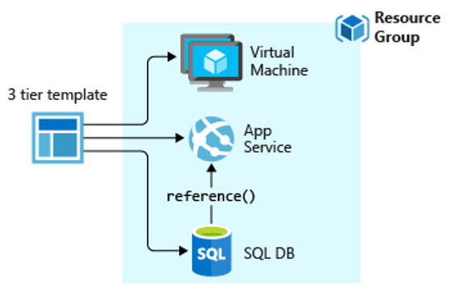

## ARM Templates

Modelos do Azure Resource Manager são arquivos JSON usados ​​para automatizar a implantação de ambientes do Azure usando infraestrutura como código. Com o uso da infraestrutura como código, o repositório de código para os aplicativos do seu projeto agora também tem a maneira de implantar toda a infraestrutura necessária ao seu aplicativo de maneira codificada, repetível e com controle de versão da mesma forma que os próprios aplicativos.

Através do ARM Templates, você automatiza toda a implantação do seu ambiente, desde a criação da rede, armazenamento, máquinas virtuais, instalação de dependências até a implantação da própria aplicação de forma orquestrada.

Se você estiver interessado em saber mais sobre os modelos ARM e como usá-los, acesse a documentação disponível em [https://docs.microsoft.com/pt-br/azure/azure-resource-manager/templates/overview](https://docs.microsoft.com/pt-br/azure/azure-resource-manager/templates/overview). Atualmente, temos cerca de 1000 modelos prontos e disponíveis para uso nos Modelos Quickstart do Azure, confira [https://azure.microsoft.com/pt-br/resources/templates/](https://azure.microsoft.com/pt-br/resources/templates/)

Recentemente, foi introduzida uma nova linguagem para o desenvolvimento de modelos ARM. A linguagem é chamada Bicep e está atualmente em *preview*. Os modelos Bicep e JSON oferecem os mesmos recursos. Você pode converter o modelo entre as duas linguagens. O Bicep fornece uma sintaxe mais fácil de usar para criar modelos. Para obter mais informações, consulte [O que é o Bicep (Preview)](https://docs.microsoft.com/pt-br/azure/azure-resource-manager/templates/bicep-overview).

Por outro lado, se você estiver mais familiarizado com ferramentas de código aberto como o Terraform para automatizar implantações em sua estratégia de IaC, poderá encontrar muitos recursos úteis aqui: [https://docs.microsoft.com/pt-br/azure/developer/terraform/](https://docs.microsoft.com/pt-br/azure/developer/terraform/)

### Pro tip!

✔️ [Implante e gerencie recursos no Azure usando modelos ARM](https://docs.microsoft.com/pt-br/learn/paths/deploy-manage-resource-manager-templates/)

---

Anterior | Próximo | 
:----- |:-----
[Melhores práticas para Azure Policy](/guide/policy-best-practices.md )| [Azure Blueprints](/guide/blueprints.md)
