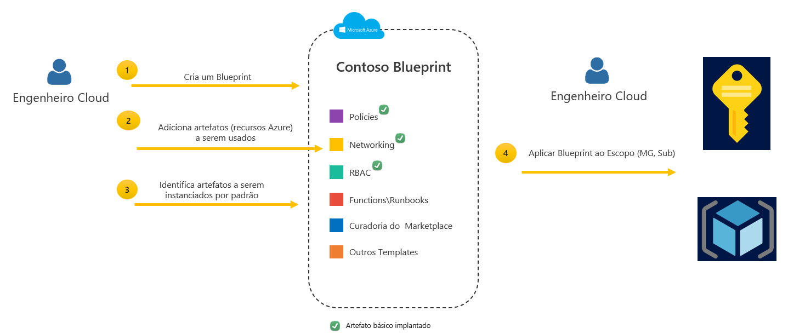

## Azure Blueprints

Como você pode trazer tudo o que já foi discutido de forma estruturada, para que possa configurar seu ambiente de forma consistente e automatizada, em escala no menor tempo possível?

Para um desenvolvedor, há muito a fazer ao configurar uma assinatura do Azure pela primeira vez. Como você pode dizer, Azure é uma tela vazia e se você não é um artista, há muito o que desenhar. E tentar preencher essa tela com uma imagem básica é o objetivo do Blueprint. Ele tenta criar uma base fundamental para a aparência de seu ambiente.

Não há motivo para sua equipe DevOps se tornarem ninjas na rede do Azure, eles só precisam se concentrar em seu código, lógica de negócios etc. e é isso.

O que acontece hoje é que você fornece a eles um documento gigante com todas as especificações exigidas e organiza várias reuniões com eles para se certificar de que entendem e seguem essas especificações, ou apenas faz de tudo por eles, o que aumenta o tempo de implementação, pois há seria um alinhamento de outros devops aguardando o provisionamento do seu ambiente.

Portanto, aqui estão alguns dos principais desafios para os clientes ao projetar e configurar a governança de suas assinaturas:
* **Desafiador para configurar a infraestrutura básica**: torna-se complexo criar e redistribuir a infraestrutura.
* **Incapacidade de criar assinaturas governadas**: Ausência de uma forma centralizada de definir e garantir que o que é criado ou disponibilizado em uma assinatura será aplicado. O cliente usa uma tonelada de scripts para tentar fazer isso.
* **Proteção de recursos críticos**: Os proprietários de assinaturas podem modificar recursos e remover políticas que violem as práticas recomendadas definidas por arquitetos de nuvem.
Portanto, para lidar com esses desafios principais enfrentados pelos clientes, o Azure Blueprints foi criado onde você tem uma solução automatizada e fácil de implantar para ajudar a configurar as Assinaturas do Azure de acordo com uma estratégia de governança.

Os Blueprints do Azure permitem que você implemente Governança como Código.

### Como funciona o Azure Blueprints

Referência: [https://docs.microsoft.com/pt-br/azure/governance/blueprints/overview](https://docs.microsoft.com/pt-br/azure/governance/blueprints/overview)

---

Anterior| Próximo | 
:----- |:-----
[ARM Templates](/guide/arm.md)| [Azure Resource Graph](/guide/resource-graph.md)
