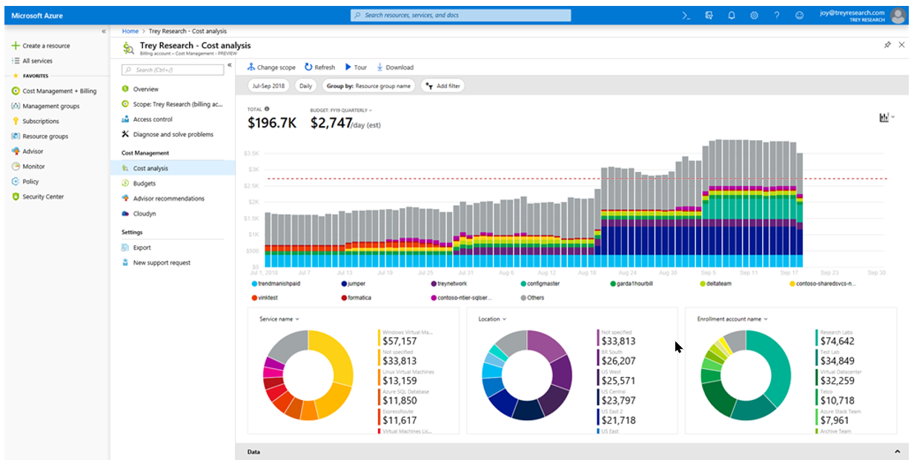

## Cost Management

Azure Cost Management é a ferramenta para gerenciar a governança de custos de um ambiente.

Permite entender a alocação de custos, criar orçamentos, configurar o recebimento de alertas com base em orçamentos definidos e a criação de visualizações com base em critérios personalizados. Todas essas opções podem ser feitas por escopos diferentes, sejam eles grupos de gerenciamento, assinaturas ou grupos de recursos.

Também é possível baixar os gráficos criados em PNG, Excel e CSV e exportar automaticamente os dados para uma conta de armazenamento em uma base diária, semanal ou mensal.

Mesmo no Gerenciamento de Custos, você pode ver as recomendações de custo do [Azure Advisor](https://docs.microsoft.com/pt-br/azure/advisor/advisor-overview), acessar seus dados de fatura e métodos de pagamento associados. Além disso, você também pode comprar reservas do Azure, onde inicialmente só era possível comprar [reservas](https://docs.microsoft.com/pt-br/azure/cost-management-billing/reservations/save-compute-costs-reservations) para máquinas virtuais, porém hoje é possível reservar recursos como armazenamento, serviços de dados e planos de software como SUSE Linux, Red Hat e VMWare.

Além de tudo isso, um recurso adicional que pode ser interessante se você estiver em uma estratégia de várias nuvens é permitir que você faça login em sua conta da AWS e gerencie o faturamento de várias nuvens por meio de uma única ferramenta.

Referências:
* [https://docs.microsoft.com/pt-br/azure/cost-management-billing/cost-management-billing-overview](https://docs.microsoft.com/pt-br/azure/cost-management-billing/cost-management-billing-overview)
* [https://docs.microsoft.com/pt-br/azure/architecture/framework/cost](https://docs.microsoft.com/pt-br/azure/architecture/framework/cost)

### Pro Tip!

✔️ [Controle os gastos do Azure e gerencie contas com Azure Cost Management + Billing](https://docs.microsoft.com/pt-br/learn/paths/control-spending-manage-bills/)

---

Previous| Next | 
:----- |:-----
[Azure Management Group](/guide/management-group.md)| [Conclusion](/guide/conclusion.md)
