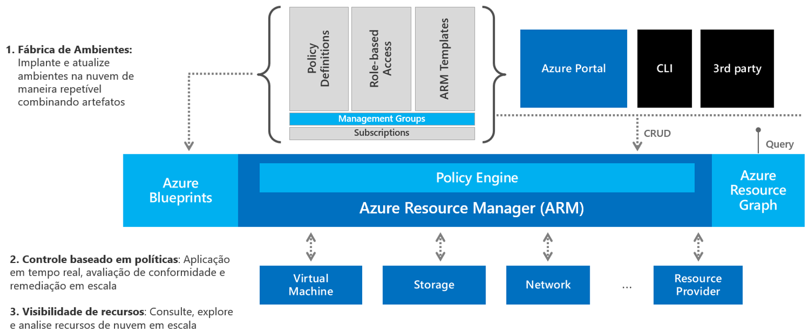

## Arquitetura de Governança no Azure

Vamos adicionar esses recursos de governança a um diagrama:

Pense em várias equipes de desenvolvimento ou unidades de negócios que desejam consumir recursos do Azure para atender a seus requisitos específicos de negócios. Quantas dessas pessoas, especialmente DevOps, saberão prontamente como projetar e configurar corretamente os componentes de rede?

Em última análise, você deseja uma maneira rápida e eficiente de implantar e atualizar ambientes em nuvem de maneira repetível usando artefatos combináveis.

Você começaria configurando seus blueprints. E esses blueprints teriam todos os componentes básicos e necessários para uma solução inteira, como suas definições de políticas, funções RBAC, modelos ARM, número de assinaturas necessárias e os grupos preliminares já concedidos os níveis de acesso apropriados aos recursos nesse blueprint, como como suas VMs, contas de armazenamento, componentes de rede e quaisquer outros provedores de recursos.

Por último, você pode aproveitar o Resource Graph para verificar o ambiente e garantir, por exemplo, se o número de recursos está de acordo com seu orçamento.

---

Anterior| Próximo | 
:----- |:-----
[Visão geral dos recursos nativos do Azure para governança em nuvem](/guide/overview-native-features.md)| [Azure Active Directory](/guide/aad.md)
