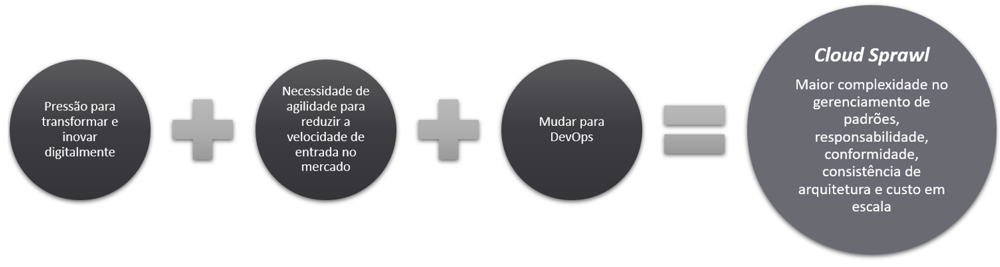
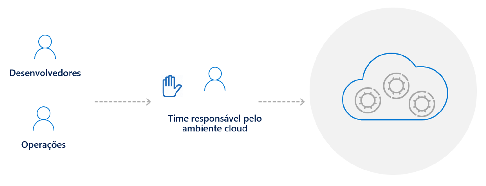
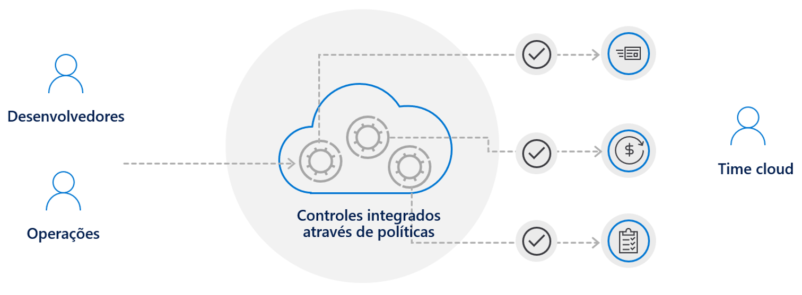

## Por que a governança é necessária?

As empresas estão adotando a nuvem para ser mais ágil e economizar dinheiro. Há uma pressão para transformar e inovar digitalmente, para que você não tenha mais tempo para se concentrar em sua própria infraestrutura. Você quer se concentrar em deixar seus clientes satisfeitos, fornecendo serviços de alta qualidade com o suporte de suas equipes de engenharia. Portanto, há uma mudança natural para DevOps em um ambiente de nuvem, onde os engenheiros fornecerão mais rapidamente os recursos necessários para dar suporte a uma solução.

No entanto, essa agilidade e fácil acesso aos recursos têm um preço e muitas empresas estão lutando para controlar esse Cloud Sprawl**. Já vimos isso antes, no início de 2000, com a introdução da virtualização e a proliferação da virtualização.

** O termo Cloud Sprawl é a proliferação descontrolada de instâncias, serviços ou provedores de nuvem em uma organização. Ele tipicamente ocorre quando uma organização não tem visibilidade ou controle sobre seus recursos de computação em nuvem.

Como a induústria reagiu a essa expansão? Pulamos na frente dos desenvolvedores e das equipes de operações e os paramos antes que as coisas saíssem do controle. Em seguida, introduzimos um processo formal para essas equipes seguirem onde deveriam preencher um formulário para que a equipe de infra-estrutura pudesse organizar tudo e em 2 semanas teriam acesso ao seu ambiente.

<em>Abordagem tradicional, sacrificando a velocidade pelo controle</em>

 
No entanto, essa abordagem na era das nuvens retarda as coisas e você sacrifica a velocidade para estar no controle.

Em um modelo de governança nativo da nuvem, você obtém velocidade e controle ao mesmo tempo. Então, em vez de pular na frente da equipe de DevOps para ter certeza de que estão fazendo as coisas certas, a própria plataforma de nuvem aplicará esse controle em seu nome. Isso permite que eles tenham acesso total à plataforma por meio de um modelo de autosserviço essencial para manter a agilidade e a velocidade.

Você pode garantir que suas equipes implantarão apenas recursos aprovados e qualquer coisa fora dessas regras será efetivamente negada. Dessa forma, você mantém seus custos previsíveis e mais alinhados com seu orçamento.

<em>Modelo de governança de nuvem nativo, com velocidade e controle juntos</em>

 

Alinhado com a governança, é importante ter uma estrutura bem definida em torno das responsabilidades entre as diferentes equipes, especialmente se você estiver migrando de uma abordagem tradicional para uma abordagem de nuvem. Dito isso, você deve dar uma olhada nessas referências para ajudá-lo a amadurecer as estruturas da equipe e alinhar as responsabilidades dentro delas:

* [Estruturas de equipes maduras](https://docs.microsoft.com/pt-br/azure/cloud-adoption-framework/organize/organization-structures)
* [Alinhamento de responsabilidade entre equipes](https://docs.microsoft.com/pt-br/azure/cloud-adoption-framework/organize/raci-alignment)

### Pro tip!

Se a nuvem é algo novo para você, tenho algumas sugestões para ajudá-lo a começar a desenvolver suas habilidades técnicas:

✔️ [Criar habilidades técnicas](https://docs.microsoft.com/pt-br/azure/cloud-adoption-framework/organize/suggested-skills)
 
✔️ [Princípios Básicos do Azure, parte 1: descrever os principais conceitos do Azure](https://docs.microsoft.com/pt-br/learn/paths/az-900-describe-cloud-concepts/)
 
✔️ [Princípios Básicos do Azure, parte 2: descrever os principais serviços do Azure](https://docs.microsoft.com/pt-br/learn/paths/az-900-describe-core-azure-services/)
 
✔️ [Princípios Básicos do Azure, parte 3: descrever as principais soluções e ferramentas de gerenciamento no Azure](https://docs.microsoft.com/pt-br/learn/paths/az-900-describe-core-solutions-management-tools-azure/)
 
✔️ [Princípios Básicos do Azure, parte 4: descrever os recursos gerais de segurança de rede e segurança](https://docs.microsoft.com/pt-br/learn/paths/az-900-describe-general-security-network-security-features/)
 
✔️ [Princípios Básicos do Azure, parte 5: descrever recursos de identidade, governança, privacidade e conformidade](https://docs.microsoft.com/pt-br/learn/paths/az-900-describe-identity-governance-privacy-compliance-features/)
 
✔️ [Princípios Básicos do Azure, parte 6: descrever os contratos de nível de serviço e gerenciamento de custos do Azure](https://docs.microsoft.com/pt-br/learn/paths/az-900-describe-azure-cost-management-service-level-agreements/)
 
✔️ [Pré-requisitos para administradores do Azure](https://docs.microsoft.com/pt-br/learn/paths/azure-administrator-prerequisites/)
 
✔️ [Crie soluções de alto nível com o "Well Architected Framework"do Microsoft Azure](https://docs.microsoft.com/pt-br/learn/paths/azure-well-architected-framework/)

---
| Próximo | 
|:-----
| [Visão geral dos recursos nativos do Azure para governança em nuvem](/guide/overview-native-features.md)

