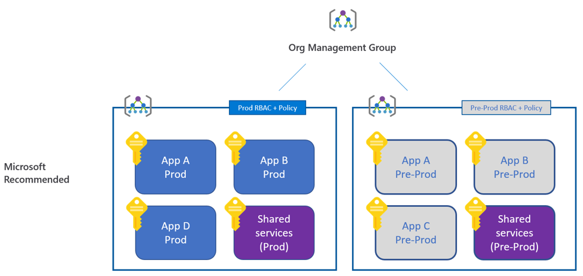
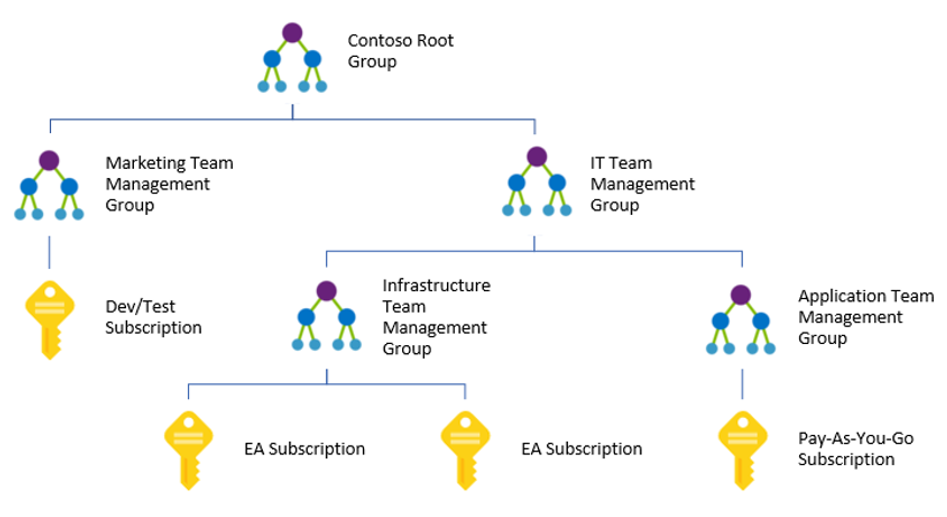

## Management Groups

Em termos das melhores práticas de configuração de governança em seu ambiente, estruturar sua hierarquia e organizar seus recursos é a primeira etapa crítica.

Tudo o que você faz, desde a configuração de regras RBAC para recursos, da Política do Azure para Blueprint, todas essas coisas dependem da hierarquia e o primeiro benefício do Grupo de Gerenciamento é a herança. Portanto, tudo o que você aplicar no topo será herdado até o nível mais baixo de sua estrutura.

Digamos que uma equipe SOC aplique um conjunto de controles de segurança na parte superior para proteger todo o ambiente. O problema hoje é que os proprietários da assinatura podem remover qualquer controle no nível da assinatura, e você geralmente torna as equipes de desenvolvimento proprietários da assinatura apenas porque precisam dessa flexibilidade. Com os grupos de gerenciamento, esse problema não ocorre, pois os proprietários não poderão remover as permissões herdadas do nível superior.

Você também pode definir um conjunto mais rígido de controles no ambiente de produção vs teste / pré-produção, por exemplo. Ou você pode ter um controle mais sensível ao custo em seu ambiente de teste. Ou você pode isolar totalmente seu ambiente de teste da Internet ...

Outro benefício dos grupos de gerenciamento é que, se você tomou decisões erradas ao configurar seus controles, você pode criar outra hierarquia de grupo de gerenciamento e transferir suas assinaturas sem problemas.

Obviamente, além de usar grupos de gerenciamento para gerenciar a aplicação de políticas em diferentes ambientes, ele também ajudará na organização de suas assinaturas, oferecendo suporte a:

* Criação de hierarquias de gerenciamento personalizadas para se adequar à sua organização
* Uso de RBAC, políticas de etiquetagem, análise de custos e orçamentos em qualquer escopo
* Uso compartilhado de políticas, centro de segurança e serviços de gerenciamento de identidade privilegiada

Referência: [https://docs.microsoft.com/en-us/azure/governance/management-groups/overview](https://docs.microsoft.com/en-us/azure/governance/management-groups/visão global)

### Pro tip!

✔️ [Gerenciar usuários e grupos no Azure Active Directory] (https://docs.microsoft.com/pt-br/learn/modules/manage-users-and-groups-in-aad/)

---

Anterior | Próximo |
: ----- |: -----
[Azure Resource Graph] (/guide/resource-graph.md) | [Azure Cost Management] (/guide/cost-management.md)