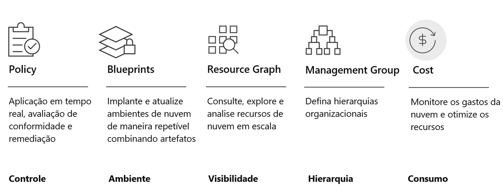

## Visão geral dos recursos nativos do Azure para governança em nuvem

Os recursos que temos no portfólio do Azure para fornecer esse nível de controle são o que você vê na imagem acima. Todos esses são recursos nativos da plataforma, ou seja, nada aqui é um produto diferente que você precise adquirir ou implantar em seu ambiente de nuvem. No momento em que você cria sua primeira assinatura, esses recursos estão lá para você usar imediatamente e são totalmente gratuitos.

**Policy:** Aqui é onde você definirá o que pode ou não ser implantado na nuvem. Ele verificará constantemente suas assinaturas e recursos para garantir que tudo esteja de acordo com as regras corporativas.

**Blueprints:** Ajuda você a configurar seu ambiente de nuvem para que seja administrado de maneira adequada e implantado de maneira repetível. Permite uma espécie de implantação de governança como código (governance as a code). As assinaturas são disponibilizadas aos times de desenvolvimento ou departamentos à medida que são criadas. O objetivo aqui é que, quando os times forem apresentados a uma assinatura controlada pelo Blueprints, a quantidade de tempo que precisam levar desde as configurações iniciais de uma assinatura, permissionamentos, políticas, etc até a implementação do projeto em produção diminua drasticamente.

**Resource Graph:** Esta é uma tecnologia de Big Data onde trazemos as configurações de todos os seus recursos do seu ambiente de nuvem e oferecemos a você, por meio de uma linguagem de consulta estruturada, a capacidade de explorar seu ambiente muito rapidamente, permitindo visibilidade em escala sobre todo o seu ambiente.

**Management Group:** Se a sua organização tiver muitas assinaturas, você pode precisar de uma maneira de gerenciar com eficiência o acesso, as políticas e a conformidade para essas assinaturas. Isso pode ser feito por meio do Grupo de gerenciamento.

**Cost Management:** Ajuda você a entender a fatura do Azure, monitorar e controlar os gastos e otimizar o uso de recursos. Permite analisar custos, criar e gerenciar orçamentos, exportar dados, examinar recomendações e agir com base nelas.

---

Anterior| Próximo | 
:----- |:-----
[Por que a governança é necessária?](/guide/governance-needed.md)  | [Arquitetura de governança no Azure](/guide/governance-architecture.md)
