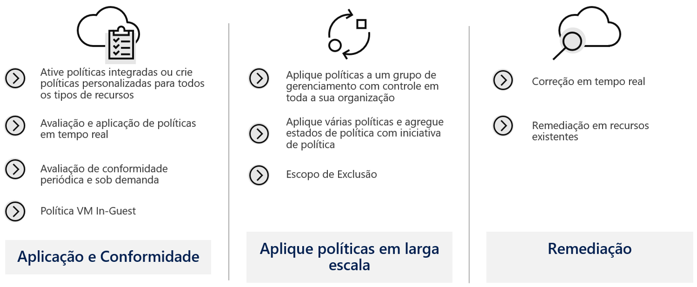
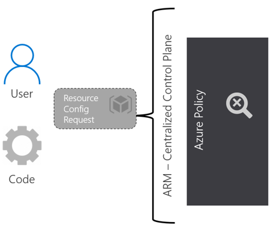
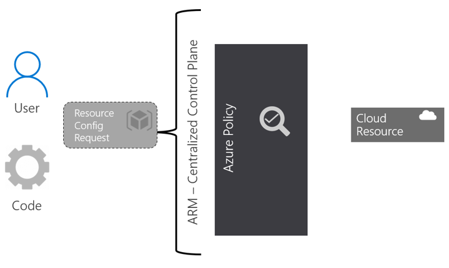
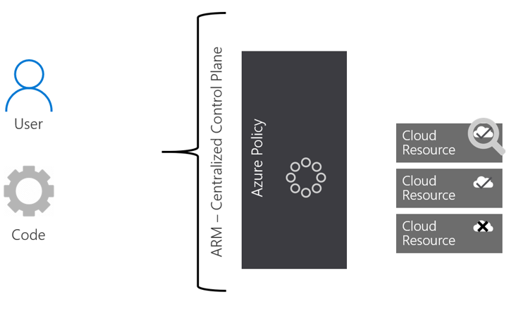
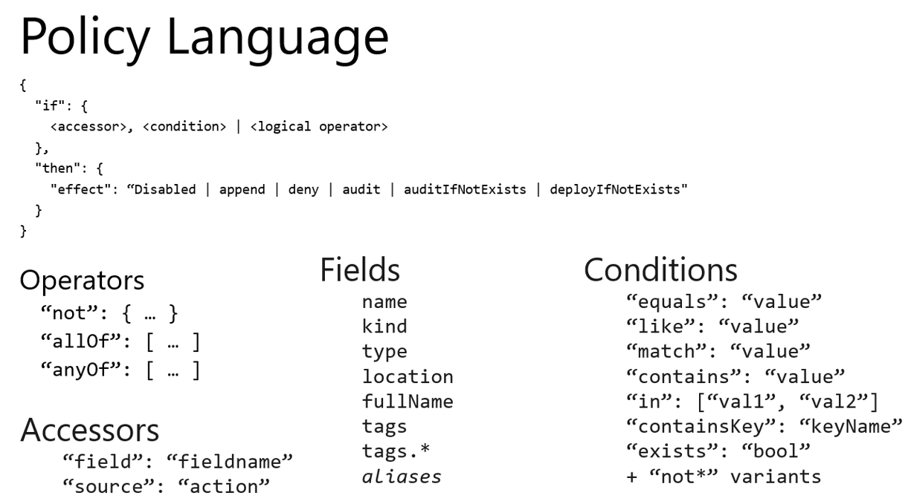

### Azure Policy

A política é a espinha dorsal da implementação e conformidade do Azure. A conformidade é um cenário em evolução que você sempre precisará avaliar e ajustar de acordo com as necessidades do momento. Você também precisa planejar cuidadosamente suas políticas para não interromper outras unidades que exigem uma política mais flexível do que aquela que você definiu.

Por meio de políticas, você pode controlar os tipos de recursos que podem ser provisionados. Ou você pode restringir os locais onde os recursos podem ser provisionados. Ao contrário do RBAC, a política é um sistema padrão de permissão explícita e negação.

A Política do Azure é um serviço que você usa para criar, atribuir e gerenciar definições de política. As definições de política impõem diferentes regras e ações sobre seus recursos, de forma que esses recursos permaneçam em conformidade com seus padrões corporativos e acordos de nível de serviço.

A política se concentra nas propriedades dos recursos durante a implantação e nos recursos existentes. Ele realiza uma avaliação de seus recursos, verificando aqueles que não estão em conformidade com as definições de política que você possui. Um novo recurso muito interessante é a política de convidado VM, que estende a capacidade da política para os recursos em execução em suas VMs.

Abaixo, um exemplo de como a Política do Azure pode ajudar na governança.

Seu time DevOps solicita a implantação de recursos no Azure para um determinado projeto usando um modelo JSON pré-construído para tornar as coisas mais fáceis e rápidas. Digamos que eles queiram implantar 5 VMs da série G na Europa (alta proporção de memória para CPU e são ideais para servidores de banco de dados) e 5 Ls nos EUA (alta taxa de transferência de disco, ideal para big data e SQL).

A Política do Azure entra em ação e verifica

**Ordem de avaliação**

As solicitações para criar ou atualizar um recurso por meio do Azure Resource Manager são avaliadas primeiro pela Política. A política cria uma lista de todas as atribuições que se aplicam ao recurso e avalia o recurso em relação a cada definição. A política processa vários dos efeitos antes de encaminhar a solicitação ao Provedor de Recursos apropriado. Isso evita o processamento desnecessário por um Provedor de Recursos quando um recurso não atende aos controles de governança projetados da Política.

**Disabled** é verificado primeiro para determinar se a regra de política deve ser avaliada.

**Append** é então avaliado. Uma vez que append pode alterar a solicitação, uma mudança feita por append pode impedir que um efeito de auditoria ou negação seja acionado. Append é usado para adicionar campos adicionais ao recurso solicitado durante a criação ou atualização. Um exemplo comum é adicionar tags a recursos como costCenter ou especificar IPs permitidos para um recurso de armazenamento.

**Deny** é então avaliado. Ao avaliar a negação antes da auditoria, evita-se o registro duplo de um recurso indesejado. Negar é usado para evitar uma solicitação de recurso que não corresponda aos padrões definidos por meio de uma definição de política e a solicitação falhar.

**Audit** é então avaliada antes que a solicitação vá para o Provedor de Recursos. A auditoria é usada para criar um evento de aviso no log de atividades ao avaliar um recurso não suportado, mas não para a solicitação

Depois que o provedor de recursos retorna um código de sucesso, AuditIfNotExists e DeployIfNotExists avaliam para determinar se log de conformidade adicional ou ação é necessária.

**AuditIfNotExists**

AuditIfNotExists ativa a auditoria em recursos que correspondem à condição **if **, mas não tem os componentes especificados nos **detalhes** da condição **then**

**DeployIfNotExists**

Semelhante a AuditIfNotExists, DeployIfNotExists executa uma implantação de modelo quando a condição é atendida.

Referência: [https://docs.microsoft.com/pt-br/azure/governance/policy/overview](https://docs.microsoft.com/pt-br/azure/governance/policy/overview) 

---

Anterior | Próximo | 
:----- |:-----
[Resource Lock](/guide/resource-lock.md)| [ARM Templates](/guide/arm.md)
