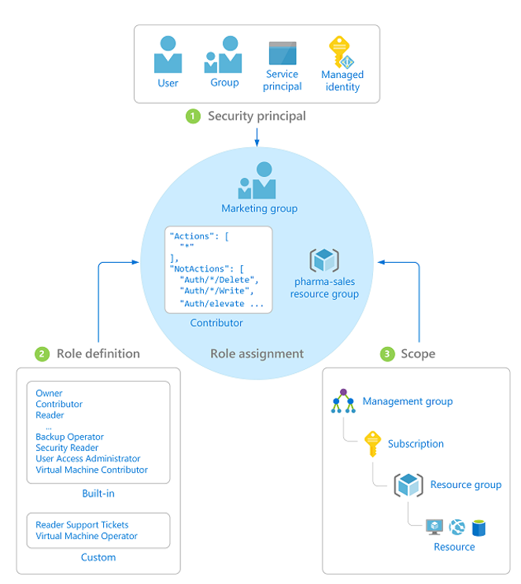
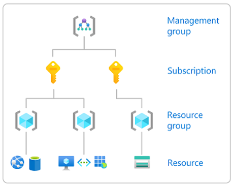

## RBAC

O controle de acesso baseado em função (RBAC) permite que você separe tarefas dentro de sua equipe e conceda apenas a quantidade de acesso de que os usuários precisam para realizar suas tarefas. Em vez de dar a todos permissões irrestritas em sua assinatura ou recursos do Azure, você só pode permitir certas ações dentro de um determinado escopo.

**Security Principal**

Uma entidade de segurança é um objeto que representa um usuário, grupo, entidade de serviço ou identidade gerenciada que está solicitando acesso aos recursos do Azure.

- *Service Principal*: uma identidade de segurança usada por aplicativos ou serviços para acessar recursos específicos do Azure. Você pode pensar nisso como uma identidade de usuário (nome de usuário e senha ou certificado) para um aplicativo.

- *Managed Identity*: uma identidade no Azure Active Directory que é gerenciada automaticamente pelo Azure. Normalmente, você usa identidades gerenciadas ao desenvolver aplicativos em nuvem para gerenciar credenciais para autenticação nos serviços do Azure.

**Role Definition**

Uma definição de função é uma coleção de permissões. Às vezes, é apenas chamado de papel. Uma definição de função lista as operações que podem ser executadas, como leitura, gravação e exclusão. As funções podem ser de alto nível, como proprietário, ou específicas, como leitor de máquina virtual. Você pode criar funções personalizadas se nenhuma das funções integradas existentes não atender às necessidades específicas da sua organização.

**Scope**

O escopo é o limite ao qual o acesso se aplica. Ao atribuir uma função, você pode limitar ainda mais as ações permitidas definindo um escopo. Isso é útil se você deseja tornar alguém um Contribuidor do Site, por exemplo, mas apenas para um grupo de recursos.

Os escopos podem ser Management Groups (grupos de gerenciamento)**, assinaturas, grupo de recursos ou o próprio recurso. É importante observar que as permissões RBAC possuem uma hierarquia de cima para baixo, o que significa que ao definir uma definição de função em um escopo superior, ela será replicada para objetos no escopo inferior. Portanto, se você conceder permissão de Contribuidor a alguém no nível da assinatura, essa permissão será herdada em todos os grupos de recursos dessa assinatura, bem como nos recursos.

Reference: [https://docs.microsoft.com/pt-br/azure/role-based-access-control/overview](https://docs.microsoft.com/pt-br/azure/role-based-access-control/overview)

** Grupo de gerenciamento é um recurso do Azure para facilitar o gerenciamento de acesso e políticas em ambientes com várias assinaturas. Abordaremos isso com mais detalhes nos tópicos avançados de governança.

### Pro tip!

✔️ [Gerenciar o acesso a uma assinatura do Azure usando o controle de acesso baseado em função do Azure](https://docs.microsoft.com/pt-br/learn/modules/manage-subscription-access-azure-rbac/)

---

Anterior| Próximo | 
:----- |:-----
[Resource Tags](/guide/resource-tags.md)| [Resource Lock](/guide/resource-lock.md)
