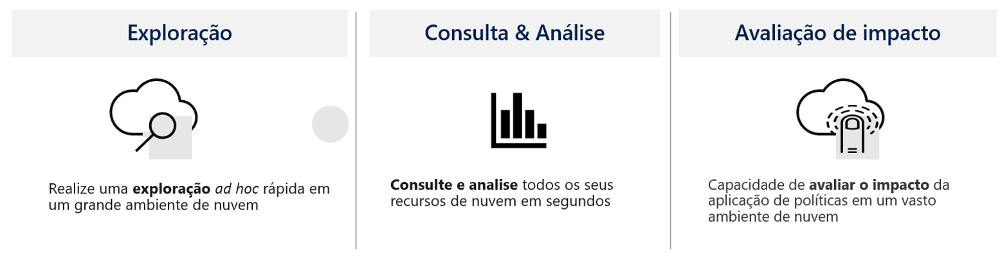
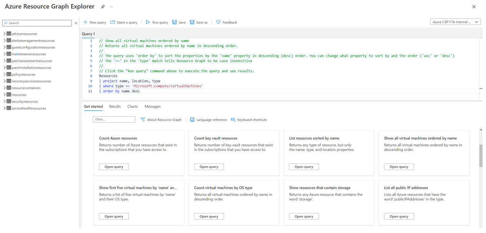

## Azure Resource Graph

Existem alguns desafios hoje quando se trata de obter visibilidade de todas as propriedades de seus recursos em todas as assinaturas e entender como eles podem impactar negativamente sua organização, seja do ponto de vista de custo ou de segurança.

* Incapacidade de visualizar recursos e suas propriedades entre assinaturas distintas
* Consultar recursos (sem se preocupar com timeouts e  throttling), incluindo filtragem, agrupamento e classificação de recursos por propriedades de recurso
* O Resource Graph fornece uma maneira de explorar interativamente os recursos, para que você possa avaliar o impacto da aplicação de políticas em um vasto ambiente de nuvem

O Resource Graph é a ferramenta que vem atender a essas necessidades, permitindo que você consulte e explore seus recursos em tempo real.

Referência: [https://docs.microsoft.com/pt-br/azure/governance/resource-graph/overview](https://docs.microsoft.com/pt-br/azure/governance/resource-graph/overview)

---

Anterior | Próximo | 
:----- |:-----
[Azure Blueprints](/guide/blueprints.md)| [Azure Management Group](/guide/management-group.md)