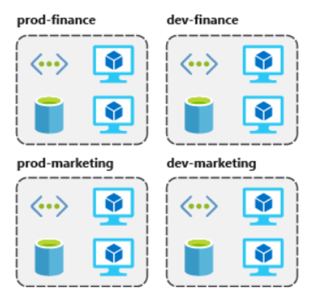

## Resource Groups

Os grupos de recursos são a abordagem que permite agrupar uma coleção de objetos em grupos lógicos, facilitando o provisionamento, o monitoramento, o acesso e o controle de custos. O benefício de usar grupos de recursos é precisamente o agrupamento de recursos que fazem parte do mesmo aplicativo ou compartilham o mesmo ciclo de vida, desde a criação até o desprovisionamento.

A tecnologia subjacente que capacita grupos de recursos é [Azure Resource Manager (ARM)](https://docs.microsoft.com/pt-br/azure/azure-resource-manager/management/overview). Apenas para informação, o ARM foi criado para substituir a tecnologia anterior chamada Azure Service Manager (ASM) que alimentava o antigo portal de gerenciamento do Azure. No ASM, os usuários criavam recursos de uma maneira não estruturada, levando a muitos desafios no rastreamento desses recursos ou no entendimento de suas dependências. Você pode ver mais detalhes aqui: [https://docs.microsoft.com/pt-br/azure/azure-resource-manager/management/deployment-models#history-of-the-deployment-models](https:/ /docs.microsoft.com/pt-br/azure/azure-resource-manager/management/deployment-models#history-of-the-deployment-models)

Desde que o ARM se tornou disponível, esses e outros desafios foram resolvidos, além de fornecer um novo conjunto de interfaces de programação de aplicativos (APIs) para provisionar recursos no Azure. O ARM requer que os recursos sejam colocados em grupos de recursos, permitindo o agrupamento lógico dos recursos relacionados.

<em>Exemplo de organização de recursos em grupos de recursos distintos</em>

Referências adicionais:

* [https://docs.microsoft.com/pt-br/learn/modules/control-and-organize-with-azure-resource-manager/2-principles-of-resource-groups](https://docs.microsoft.com/pt-br/learn/modules/control-and-organize-with-azure-resource-manager/2-principles-of-resource-groups)
* [https://docs.microsoft.com/pt-br/azure/azure-resource-manager/management/manage-resource-groups-portal#create-resource-groups](https://docs.microsoft.com/pt-br/azure/azure-resource-manager/management/manage-resource-groups-portal#create-resource-groups)

---

Anterior | Próximo | 
:----- |:-----
[Azure Subscription](/guide/subscription.md)| [Resource Tags](/guide/resource-tags.md)
