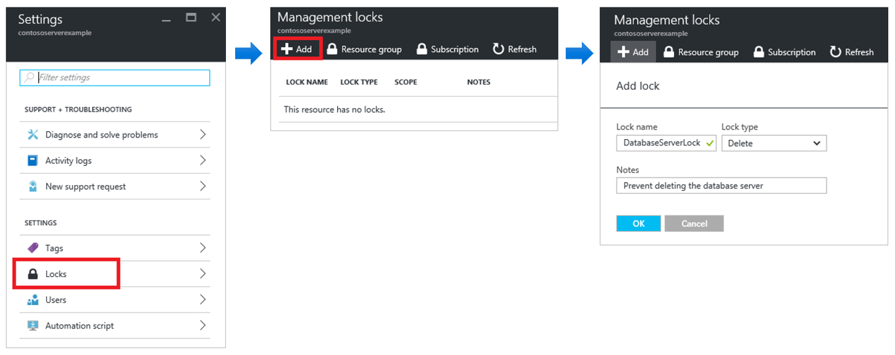

## Resource Locks

Os bloqueios de recursos são um recurso que permite evitar a exclusão ou modificação acidental de recursos críticos. O bloqueio substitui quaisquer permissões que o usuário possa ter.

Quando você aplica um bloqueio em um escopo pai, todos os recursos dentro desse escopo herdam o mesmo bloqueio. Mesmo os recursos que você adiciona posteriormente herdam o bloqueio dos pais. O bloqueio mais restritivo na herança tem precedência.

Ao contrário do controle de acesso baseado em função (RBAC), você usa bloqueios de gerenciamento para aplicar uma restrição a todos os usuários e funções.

Os bloqueios do Resource Manager se aplicam apenas a operações que ocorrem no plano de gerenciamento, que consistem em operações enviadas para [https://management.azure.com](https://management.azure.com). Os bloqueios não restringem como os recursos executam suas próprias funções. As mudanças de recursos são restritas, mas as operações de recursos não são restritas. Por exemplo, um bloqueio *ReadOnly* em um banco de dados SQL impede que você exclua ou modifique o banco de dados, mas não impede que você crie, atualize ou exclua dados no banco de dados. As transações de dados são permitidas porque essas transações não são enviadas para [https://management.azure.com](https://management.azure.com)

Aplicar *ReadOnly* pode levar a resultados inesperados porque algumas operações que se parecem com operações de leitura, na verdade, requerem ações adicionais. Por exemplo, colocar um bloqueio *ReadOnly* em uma conta de armazenamento impede que todos os usuários listem as chaves. A operação de chaves de lista é tratada por meio de uma solicitação POST porque as chaves retornadas estão disponíveis para operações de gravação. Para outro exemplo, colocar um bloqueio *ReadOnly* em um recurso do *App Service* evita que o Visual Studio Server Explorer exiba arquivos para o recurso porque essa interação requer acesso de gravação.

Referência: [https://docs.microsoft.com/pt-br/azure/azure-resource-manager/management/lock-resources](https://docs.microsoft.com/pt-br/azure/azure-resource-manager/management/lock-resources) 

---

Anterior| Próximo | 
:----- |:-----
[RBAC](/guide/rbac.md)| [Azure Policy](/guide/policy.md)
