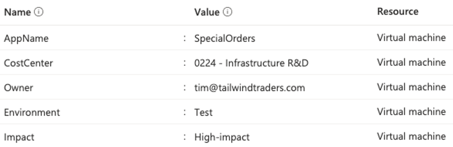

## Resource Tag

Associado a uma estratégia de padrão de bom nome está o uso de tags em objetos. As marcas são aplicadas a recursos, grupos de recursos e assinaturas para organizá-los logicamente em uma taxonomia. As tags consistem em um par chave/valor. Aqui estão alguns exemplos de tags que você pode considerar usar em seu ambiente:

Indo além do suporte em governança, o uso de tags também pode ser utilizado em estratégias de automação e controle de custos. Use os links abaixo para acessar uma decisão sobre tags e um guia de nomenclatura de recursos e um excelente material para ajudá-lo a definir a estratégia de tags:

* [https://docs.microsoft.com/pt-br/azure/cloud-adoption-framework/decision-guides/resource-tagging/](https://docs.microsoft.com/pt-br/azure/cloud-adoption-framework/decision-guides/resource-tagging/)
* [https://docs.microsoft.com/pt-br/azure/cloud-adoption-framework/ready/azure-best-practices/resource-tagging](https://docs.microsoft.com/pt-br/azure/cloud-adoption-framework/ready/azure-best-practices/resource-tagging)
