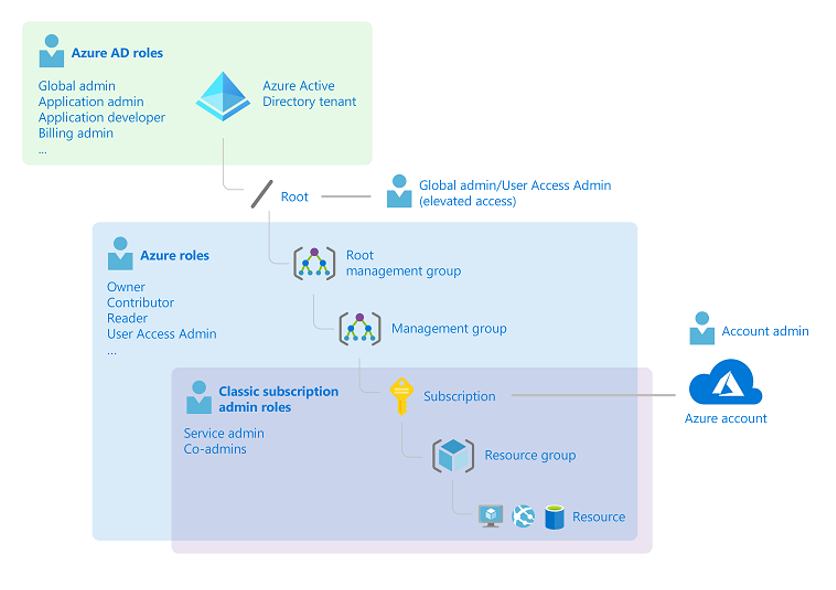

## Azure Subscription

Conforme descrito anteriormente, ao criar uma assinatura do Azure, um locatário do AAD é criado automaticamente para você. Com isso, depois de criar e/ou sincronizar usuários no Azure Active Directory, agora você pode permitir que seus usuários ADF assinem sua assinatura e seus recursos existentes.

De acordo com o tamanho do seu ambiente de nuvem, você também pode criar assinaturas adicionais ou [associar outras assinaturas existentes](https://docs.microsoft.com/pt-br/azure/active-directory/fundamentals/active-directory-how-subscriptions-associated-directory) com seu locatário do Azure Active Directory. Ter pelo menos duas assinaturas, uma para o ambiente produtivo e outra para os não produtivos, é uma boa prática para a segregação do ambiente e para [escalabilidade](https://docs.microsoft.com/pt-br/azure/cloud-adoption-framework/ready/azure-best-practices/scale-subscriptions).

Um ponto importante a ser levado em consideração sobre o permissionamento é que existem dois tipos de funções/atribuições distintas, mas totalmente relacionadas entre si:

1. [Funções do Azure](https://docs.microsoft.com/pt-br/azure/role-based-access-control/rbac-and-directory-admin-roles#azure-roles): As funções do Azure usam [Role Based Access Control (RBAC)](https://docs.microsoft.com/pt-br/azure/role-based-access-control/overview) e são concedidos no contexto de recursos do Azure em uma assinatura. Existem três funções básicas de proprietário, colaborador e leitor. Além deles, existem mais de 70 outras funções que estão mais relacionadas a serviços especificamente, [aqui você pode ver a lista com todos](https://docs.microsoft.com/pt-br/azure/role-based-access-control/built-in-roles). Além das funções nativas, você pode querer criar suas próprias [funções customizadas](https://docs.microsoft.com/pt-br/azure/role-based-access-control/custom-roles) e maximizar o tipo de controle que você deseja aplicar.
2. [Funções do Azure Active Directory](https://docs.microsoft.com/pt-br/azure/role-based-access-control/rbac-and-directory-admin-roles#azure-ad-roles): As funções do Azure Active Directory são usadas exclusivamente para o gerenciamento de recursos do Azure Active Directory.

Esta imagem pode ajudá-lo a entender um pouco sobre como as funções do Azure e do Azure Active Directory estão relacionadas:

Uma assinatura do Azure tem uma relação de confiança com o AAD para autenticar e autorizar usuários, serviços e dispositivos.

É importante saber que o mesmo tenant do AAD pode ter várias assinaturas confiando nele, mas cada assinatura só pode confiar em um único locatário AAD. Isso significa que você pode ter a mesma base de usuário no tenant do AAD para diferentes assinaturas.

Uma assinatura é um contêiner lógico para seus recursos e cada recurso está associado a apenas uma assinatura. Eles estão diretamente relacionados ao faturamento e ao pagamento.

Os dados das assinaturas permanecem por um certo tempo após serem canceladas, e as próprias assinaturas geralmente ficam visíveis, mesmo depois de canceladas no Portal e nas APIs. Há informações sobre o processo de cancelamento na [documentação disponível aqui](https://docs.microsoft.com/pt-br/azure/cost-management-billing/manage/cancel-azure-subscription).

Uma assinatura tem finalidades diferentes porque é um contrato legal, um contrato de pagamento, um limite de escala e um limite administrativo. Todos os detalhes são [descritos neste link](https://docs.microsoft.com/pt-br/azure/cloud-adoption-framework/ready/considerations/fundamental-concepts#azure-subscription-purposes).

É importante definir uma arquitetura de uso de assinaturas para que haja uma melhor organização e gestão dos recursos, especialmente na segregação de permissões e controle de [limites existentes nas assinaturas](https://docs.microsoft.com/pt-br/azure/azure-resource-manager/management/azure-subscription-service-limits). Para ajudar com isso, há um [guia de decisão](https://docs.microsoft.com/pt-br/azure/cloud-adoption-framework/decision-guides/subscriptions/) documentado  que é muito interessante para entender o melhor maneira de modelar sua organização e definir estratégias de design de assinatura.

### Breve descrição sobre Azure Landing Zones

Conforme descrito [neste link](https://docs.microsoft.com/pt-br/azure/cloud-adoption-framework/ready/azure-best-practices/initial-subscriptions), a recomendação é que hajam pelo menos duas assinaturas, uma para o ambiente produtivo e outra para o ambiente não-produtivo. Dependendo do tamanho do seu ambiente ou da estratégia da sua empresa, pode ser necessário criar mais assinaturas e além de combinar o desenho das assinaturas com a definição da [landing zone](https://docs.microsoft.com/pt-br/azure/cloud-taking-framework/ready/landing-zone/) (zona de aterrisagem) à ser criada.

O Microsoft [Cloud Adopt Framework](http://aka.ms/caf) descreve em detalhes sobre vários tópicos sobre a arquitetura de landing zone em escala corporativa, que oferece um design modular e não apenas simplifica a implantação de aplicativos novos e existentes mas também permite que as organizações comecem com uma implementação de implantação mais leve e escalem dependendo de suas necessidades de negócios.

Basicamente, a landing zone lidará com um conjunto de considerações e recomendações com base em algumas áreas de design:

* [Inscrição de contrato empresarial (EA) e locatários do Azure Active Directory](https://docs.microsoft.com/pt-br/azure/cloud-adoption-framework/ready/enterprise-scale-enterprise-enrollment-and-azure-ad-tenants/)
* [Gerenciamento de identidade e acesso](https://docs.microsoft.com/pt-br/azure/cloud-adoption-framework/ready/enterprise-scale/identity-and-access-management/)
* [Grupo de gerenciamento e organização de assinaturas](https://docs.microsoft.com/azure/pt-br/cloud-adoption-framework/ready/enterprise-scale/management-group-and-subscription-organization/)
* [Topologia e conectividade de rede](https://docs.microsoft.com/pt-br/azure/cloud-adoption-framework/ready/enterprise-scale/network-topology-and-connectivity/)
* [Gerenciamento e monitoramento](https://docs.microsoft.com/azure/pt-br/cloud-adoption-framework/ready/enterprise-scale/management-and-monitoring/)
* [Continuidade de negócios e recuperação de desastres](https://docs.microsoft.com/azure/pt-br/cloud-adoption-framework/ready/enterprise-scale/business-continuity-and-disaster-recovery/)
* [Segurança, governança e conformidade](https://docs.microsoft.com/azure/pt-br/cloud-adoption-framework/ready/enterprise-scale/security-governance-and-compliance)
* [Automação de plataforma e DevOps](https://docs.microsoft.com/en-us/azure/pt-br/cloud-adoption-framework/ready/enterprise-scale/platform-automation-and-devops)

Na landing zone, a escolha da topologia de rede a ser usada é importante para o processo de definição de governança. Como exemplo, a topologia Hub e Spoke pode ser inserida no contexto de assinaturas da seguinte forma:

* Uma primeira assinatura de **serviços compartilhados** (Rede Virtual Hub)
* Uma segunda assinatura para o ambiente de **produção** (Rede Virtual Spoke 1)
* Uma terceira assinatura para o ambiente **não produção** (Spoke2 Virtual Network)
* Algumas referências sobre a topologia Hub e Spoke:
  - [https://docs.microsoft.com/pt-br/azure/architecture/reference-architectures/hybrid-networking/hub-spoke](https://docs.microsoft.com/pt-br/azure/architecture/reference-architectures/hybrid-networking/hub-spoke)
  - [https://docs.microsoft.com/pt-br/azure/cloud-adoption-framework/decision-guides/software-defined-network/hub-spoke](https://docs.microsoft.com/pt-br/azure/cloud-taking-framework/decision-guides/software-defined-network/hub-spoke)

Atualmente, estão disponibilizadas [três diferentes implementações de referência](https://docs.microsoft.com/pt-br/azure/cloud-adoption-framework/ready/enterprise-scale/implementation) do tipo enterprise-scale, que podem ser escaladas sem refatoração quando os requisitos mudam ao longo do tempo:

* [Fundação em escala empresarial](https://github.com/Azure/Enterprise-Scale/blob/main/docs/reference/wingtip/README.md)
* [Hub e spoke em escala corporativa](https://github.com/Azure/Enterprise-Scale/blob/main/docs/reference/adventureworks/README.md)
* [Virtual WAN em escala corporativa](https://github.com/Azure/Enterprise-Scale/blob/main/docs/reference/contoso/Readme.md)

### Pro tip!

✔️ [Enterprise-Scale - Reference Implementation](https://github.com/Azure/Enterprise-Scale)

---

Anterior | Próximo | 
:----- |:-----
[Padrões de nomes](/guide/naming.md)| [Resource Groups](/guide/resource-groups.md)
